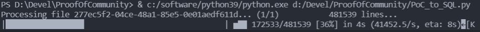

# ProofOfCommunity

A set of tool to verify the regularly published [Celsius](https://www.celsius.netowrk) Proof of Community (#PoC) data and ingest it into a (MySQL) database for further analysis.

**Example #PoC summary for the period of 18-25th of February:**


# Requirements

## Disk space

Before starting, make sure you have sufficient space on your hard drive. The current 36 weeks worth of #PoC data sits at 60GB in form of CSV files. 

When ingested into a DB, this will shrink to 11GB. Note that currently only the `interest` transaction types are considered (other transaction types are documented in the `transaction_types.txt` file and these are still to be implemented). Please note that handling all transaction types will increase the current size of the DB to ~ 15GB. Moreover, with more and more users joining Celsius each weak, expect each week's dump to grow in size, and consequently the DB size will grow quickly.

In summary, aim for sufficient storage size with ample room to grow. As you will quickly observe, the speed of the hard drive also matters a lot. In my case, I am working on a Samsung EVO 870 2TB SSD, which I think is decent, i.e. no M.2, but it gets the job done in a reasonable time.

## Software

First of all, you need a database. Since performance optimization is not in focus yet, I've started with MySQL, which I self-host via a VM. For convenience I've used a pre-packaged [Bitnami image](https://bitnami.com/stack/mysql/virtual-machine). You are on your own on how to install and configure the DB.

The important thing is that, after you are finished, you have:

* enough storage space for the DB (see above)
* a DB user account that has full access to the `Celsius` DB/schema.

In order to ingest the CSV files you will also need python 3 with the following packages installed
```
pymysql (>= 1.0.2)
alive_progress (>= 2.3.1)
```
Other versions would most probably work as well, but were not tested.

# Getting started

Once you have installed the required software, perform the following high-level steps.

1. Download the #PoC files from the https://app.celsius.network/ site and put them into the `data` subfolder.

2. Create the required tables in the `Celsius` DB by a command such as `mysql -h hostname -u user database -p < sql/create_tables.sql`. This should work out of the box for MySQL, but may fail for various reasons. Details may vary depending on your installation and even more so if you use a different DB backend. In such cases inspection of the `create_tables.sql` should make it clear which tables need to be created.

3. Change the DB access configuration (host, username, password, ...) in the `PoC_to_SQL.py` file in the function `connect_db()`.

4. Run the `PoC_to_SQL.py` ingest script from the main folder with `python3 PoC_to_SQL.py`. You should see progress being printed for each CSV file. 

In case you run the upload script multiple times you can control the behavior by changing the `__FORCE_FILE_RESCAN` variable. If this variable is set to `True`, the CSV files will be re-scanned and every transaction that is not yet within the DB will be pushed into the DB. This is especially useful during development and debugging, where the script might stop or crash because it encounters an unknown structure of the CSV file. After implementing the fix the script can be simply re-run and all already processed transactions are quickly skipped.

# What next?

After the data is ingested into the DB, you can query it to find interesting aggregated views. That was the main goal, after all! One example of such a query is provided in `sql/aggregate_query.sql`. That query aggregates, for each weak, the amount of coins held, the earned interest (also whether it was in the original coin or CEL) over all users. 

The output of the query looks like this:

| Count  | Amount     | Reward             | Coin/User          | PercentCEL          | InterestCEL        | Coin       | Date                |
| ------ | ---------- | ------------------ | ------------------ | ------------------- | ------------------ | ---------- | :------------------ |
| 376380 | 106467     | 3117458.6825993746 | 0.2828703671919775 | 0.1114440883245331  | 347422.34077168733 | BTC        | 2022-02-11 05:00:01 |
| 204530 | 1271262    | 3094292.9071043706 | 6.215529011328271  | 0.12927258017597024 | 400007.2279215858  | ETH        | 2022-02-11 05:00:01 |
| 124793 | 1406729051 | 2386883.0322094373 | 11272.499669998286 | 0.12343201109492202 | 294617.7729139564  | USDC       | 2022-02-11 05:00:01 |
| 86376  | 343242751  | 990644.9840066119  | 3973.820863447663  | 0.19496485399079622 | 193140.95466356372 | MATIC      | 2022-02-11 05:00:01 |
| 193628 | 223953363  | 866112.1914362378  | 1156.616619443368  | 1                   | 866112.1914362378  | CEL        | 2022-02-11 05:00:01 |
| 49165  | 254900103  | 415375.35171266965 | 5184.584616120335  | 0.192881657142914   | 80118.28617466046  | USDT ERC20 | 2022-02-11 05:00:01 |
| 9757   | 114934985  | 182191.9156713396  | 11779.74635310468  | 0.02656174491992512 | 4839.335190534631  | GUSD       | 2022-02-11 05:00:01 |
| 56180  | 4929429    | 154050.06044910126 | 87.74347758993115  | 0.1833814223860626  | 28249.919203815112 | DOT        | 2022-02-11 05:00:01 |
| 8665   | 2440943    | 141796.0984992667  | 281.7014200493383  | 0.06094781120377465 | 8642.16184076514   | LUNA       | 2022-02-11 05:00:01 |
| 80923  | 162224368  | 129900.15402026936 | 2004.6756531556016 | 0.1683426375948397  | 21867.734551748064 | ADA        | 2022-02-11 05:00:01 |

# Reset

In case you need for any reason to restart the process from scratch, the following script that completely clears the tables from the `Celsius` DB might be useful, `mysql -h hostname -u user database -p < sql/clear_tables.sql`. Be careful, data in the DB will be permanently lost after running this command.
